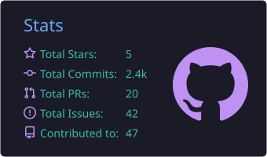

<h1 align="center">Hola, soy JuanFe 👋</h1>

  <strong>Data Scientist & Engineer @ Mercado Libre</strong> 
  Construyo modelos, pipelines y apps para que los datos se conviertan en decisiones.

  

  
  
  

---

## 🙋‍♂️ Sobre mí

- 🛒 Actualmente en **Mercado Libre**: ciencia de datos e ingeniería a gran escala
- 📱 Antes en **WOM** como Data Scientist, enfocado en valor del cliente en telecomunicaciones
- 🎯 En camino a ser el **mejor científico de datos de Latinoamérica** 🌎

---

## 🧪 Laboratorios

Donde estudio y practico, organizado por tema. Cada uno tiene su ruta de crecimiento en los issues.

| Ciencia de datos | Ingeniería | Exploración |
|:---:|:---:|:---:|
| [fundamentos-data-science](https://github.com/JuanFeDS/fundamentos-data-science) | [ingenieria-de-software](https://github.com/JuanFeDS/ingenieria-de-software) | [tech-lab](https://github.com/JuanFeDS/tech-lab) |
| [machine-learning](https://github.com/JuanFeDS/machine-learning) | [MLOps](https://github.com/JuanFeDS/MLOps) | [Economia](https://github.com/JuanFeDS/Economia) |
| [Time_Series](https://github.com/JuanFeDS/Time_Series) | [javascript-web](https://github.com/JuanFeDS/javascript-web) | [Trading_Python](https://github.com/JuanFeDS/Trading_Python) |
| [NLP](https://github.com/JuanFeDS/NLP) | [WebScraping](https://github.com/JuanFeDS/WebScraping) | [Kaggle](https://github.com/JuanFeDS/Kaggle_Project) |
| [agentes-ai](https://github.com/JuanFeDS/agentes-ai) | | [retos técnicos](https://github.com/JuanFeDS/Python_Challenges) |

---

## 💻 Stack

  

También: SQL · pandas · LightGBM · CatBoost · MLflow · LangChain · LangGraph · BigQuery · Airflow · Streamlit · Power BI · Claude Code

---

  
  

